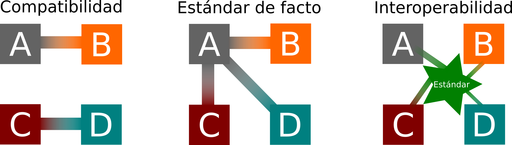

#################
Interoperabilidad
#################

La interoperabilidad es la capacidad que tiene un producto o un sistema, cuyas
interfaces son totalmente conocidas, para funcionar con otros productos o
sistemas existentes o futuros y eso sin restricción de acceso o de
implementación.

:Traducción: Pascal Chevre

La interoperabilidad puede ser vista como la capacidad de las entidades de
trabajar articuladamente con las demás, en pro de lograr el intercambio
eficiente, simple y seguro de datos.

interoperabilidad semántica
***************************

La interoperabilidad semántica es la capacidad de los sistemas informáticos
para el intercambio de datos con significado unívoco, compartida. La
interoperabilidad semántica es un requisito para permitir que la máquina
lógica computable, la inferencia, el descubrimiento de conocimiento, y la
federación de datos entre sistemas de información.

La interoperabilidad semántica es, por tanto, no concierne sólo a los
envases de los datos (sintaxis), pero si a la transmisión simultánea del
significado de los datos (semántica). Esto se logra mediante la adición de los
datos acerca de los datos (metadatos), que une cada elemento de datos de un
vocabulario controlado, compartida. El significado de los datos se transmiten
con los datos en sí, en un "paquete de información" auto-descripción que es
independiente de cualquier sistema de información. Es este vocabulario común, y
sus enlaces asociados a una ontología, que proporciona la base de la
interpretación y la capacidad de la máquina, la inferencia, y la lógica.

interoperabilidad sintáctica es un requisito previo para la interoperabilidad
semántica. interoperabilidad sintáctica se refiere a los mecanismos de
envasado y de transmisión de datos. En la asistencia sanitaria, HL7 ha estado en
uso durante más de treinta años (que es anterior a la tecnología de Internet y
la web), y utiliza el tubo de Unix (|) como delimitador de datos. El estándar
actual de Internet para el marcado de documentos XML es, que utiliza "<>" como
delimitador de datos. Los delimitadores de datos no transmiten significado para
los datos que no sean de estructurar los datos. Sin un diccionario de datos para
traducir el contenido de los delimitadores, los datos permanecen sin sentido. Si
bien hay muchos intentos de crear diccionarios de datos y modelos de información
a asociarse con estos mecanismos de empaquetamiento de datos, ninguno ha sido
práctico de implementar. Esto sólo ha perpetuado la "confusión" en curso de
los datos y la incapacidad para el intercambio de datos con significado.

- https://es.wikipedia.org/wiki/Interoperabilidad
- https://en.wikipedia.org/wiki/Interoperability

SOAP
****

SOAP (siglas de Simple Object Access Protocol) es un protocolo estándar que
define cómo dos objetos en diferentes procesos pueden comunicarse por medio de
intercambio de datos XML. Este protocolo deriva de un protocolo creado por Dave
Winer en 1998, llamado XML-RPC. SOAP fue creado por Microsoft, IBM y otros. Está
actualmente bajo el auspicio de la W3C. Es uno de los protocolos utilizados en
los servicios Web.

- https://es.wikipedia.org/wiki/Simple_Object_Access_Protocol
- https://en.wikipedia.org/wiki/SOAP

WDSL
****

WSDL son las siglas de Web Services Description Language, un formato XML que se
utiliza para describir servicios Web . La versión 1.0 fue la primera
recomendación por parte del W3C y la versión 1.1 no alcanzó nunca tal estatus.
La versión 2.0 se convirtió en la recomendación actual por parte de dicha
entidad.

WSDL describe la interfaz pública a los servicios Web. Está basado en XML y
describe la forma de comunicación, es decir, los requisitos del protocolo y los
formatos de los mensajes necesarios para interactuar con los servicios listados
en su catálogo. Las operaciones y mensajes que soporta se describen en abstracto
y se ligan después al protocolo concreto de red y al formato del mensaje.

Así, WSDL se usa a menudo en combinación con SOAP y XML Schema. Un programa
cliente que se conecta a un servicio web puede leer el WSDL para determinar qué
funciones están disponibles en el servidor. Los tipos de datos especiales se
incluyen en el archivo WSDL en forma de XML Schema. El cliente puede usar SOAP
para hacer la llamada a una de las funciones listadas en el WSDL.

El WSDL nos permite tener una descripción de un servicio web. Especifica la
interfaz abstracta a través de la cual un cliente puede acceder al servicio y
los detalles de cómo se debe utilizar.

- https://es.wikipedia.org/wiki/WSDL
- https://en.wikipedia.org/wiki/Web_Services_Description_Language

REST
****

La Transferencia de Estado Representacional (Representational State Transfer) o
REST es un estilo de arquitectura software para sistemas hipermedia distribuidos
como la World Wide Web. El proposito es mejorar el rendimiento, escalabilidad,
simplicidad, modificabilidad, Visibilidad, Portabilidad y Fiabilidad de los
 servicios. El término se originó en el año 2000, en una tesis doctoral sobre la
web escrita por Roy Fielding, uno de los principales autores de la especificación
del protocolo HTTP y ha pasado a ser ampliamente utilizado por la comunidad de
desarrollo.

- https://es.wikipedia.org/wiki/Representational_State_Transfer
- https://en.wikipedia.org/wiki/Representational_state_transfer

WADL
****

Web Application Description Language (WADL) es una descripción XML legible por
máquina de aplicaciones web basadas en HTTP (normalmente servicios web REST).1
WADL modela los recursos proporcionados por un servicio y las relaciones entre
ellos.1 WADL está diseñado para simplificar la reutilización de servicios web
basados en la arquitectura HTTP existente de la web.1 2 Es independiente de la
plataforma y del lenguaje y tiene como objetivo promover la reutilización de
aplicaciones más allá del uso básico en un navegador web.1

WADL fue presentado al World Wide Web Consortium por Sun Microsystems el 31 de
agosto de 20091 , pero el consorcio no tiene planes actualmente para
estandarizarlo.2 WADL es el equivalente de REST al Web Services Description
Language (WSDL) de SOAP, que también puede ser usado para describir servicios
web REST.3

- https://es.wikipedia.org/wiki/Web_Application_Description_Language
- https://wadl.java.net/

Descubrimiento de servicios Web
*******************************

Los servicios Web proporcionan acceso a los sistemas de software a través de
Internet utilizando protocolos estándar. En el escenario más básico hay un
proveedor de servicios Web que publica un servicio y un consumidor de servicios
Web que utiliza este servicio. El descubrir que servicios se proveen para una
tarea determinada, es la idea de este.

La publicación de un servicio web implica la creación de un software y
hacerlo accesible a los consumidores potenciales. Proveedores de Servicios Web
aumentan un servicio Web con una descripción de la interfaz mediante WSDL para
que un consumidor puede utilizar el servicio.

Opcionalmente, un proveedor puede registrar explícitamente un servicio con un
registro de servicios web tales como UDDI o publicar los documentos adicionales
destinadas a facilitar el descubrimiento como Lenguaje de Inspección de
Servicios Web (WSIL). Los usuarios de los servicios o de los consumidores pueden
buscar servicios web de forma manual o automática. La implementación de
servidores UDDI y motores WSIL debe proporcionar las API de búsqueda simple o
interfaz gráfica de usuario basada en web para ayudar a encontrar los servicios
Web.

Los servicios Web también pueden ser descubiertos a través de mecanismos de
multidifusión como WS-Discovery, reduciendo así la necesidad de registros
centralizados en redes más pequeñas.

- https://en.wikipedia.org/wiki/Web_Services_Description_Language
- https://en.wikipedia.org/wiki/Web_Services_Inspection_Language
- https://en.wikipedia.org/wiki/Web_Services_Discovery

